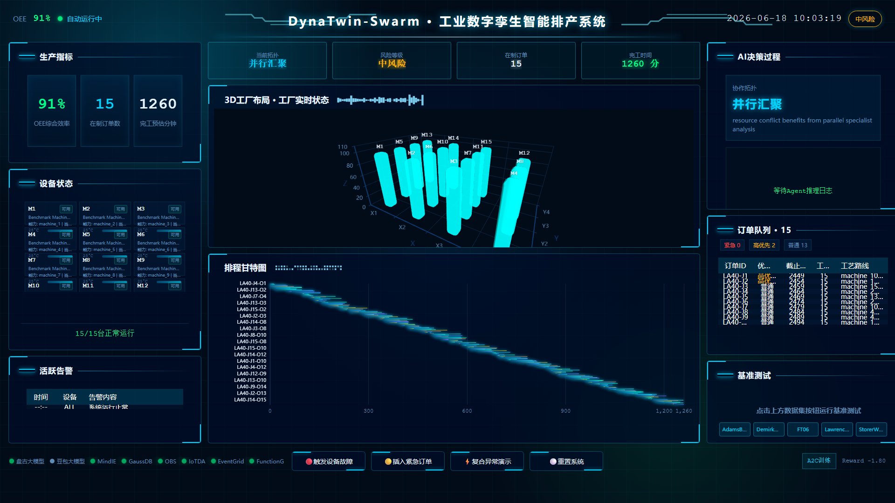
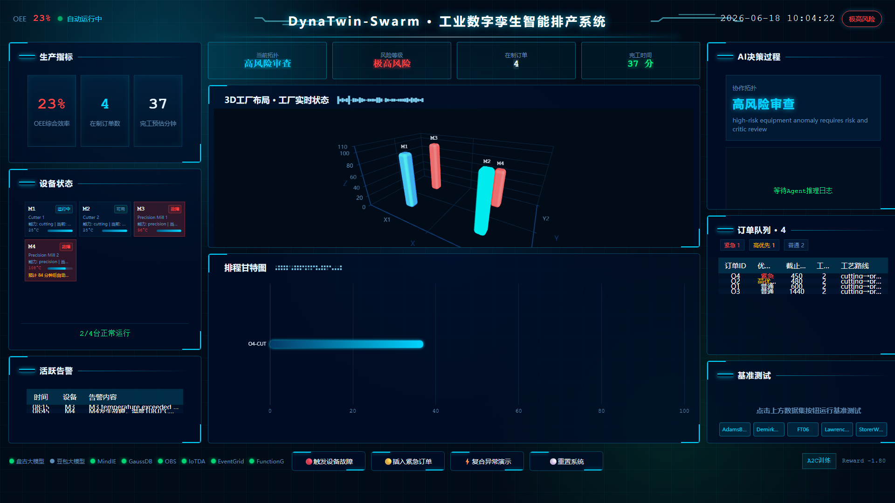
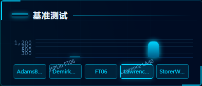
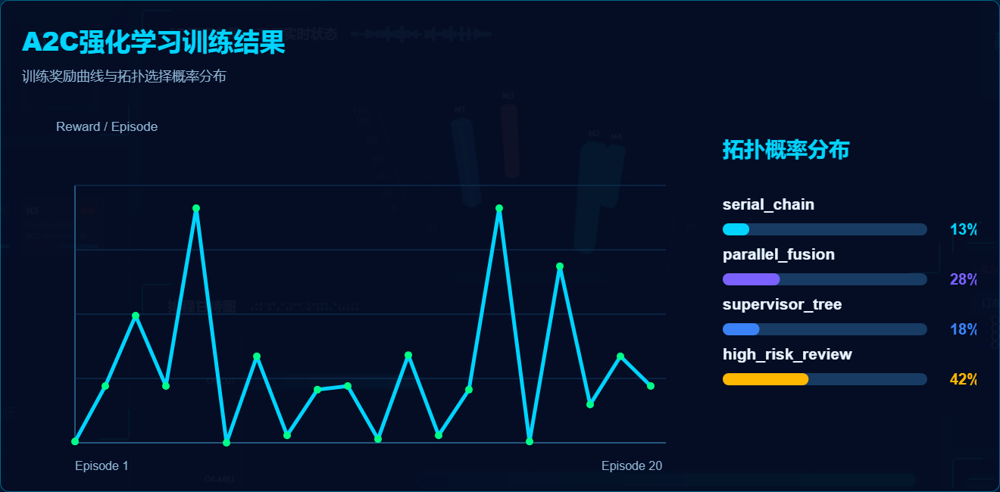
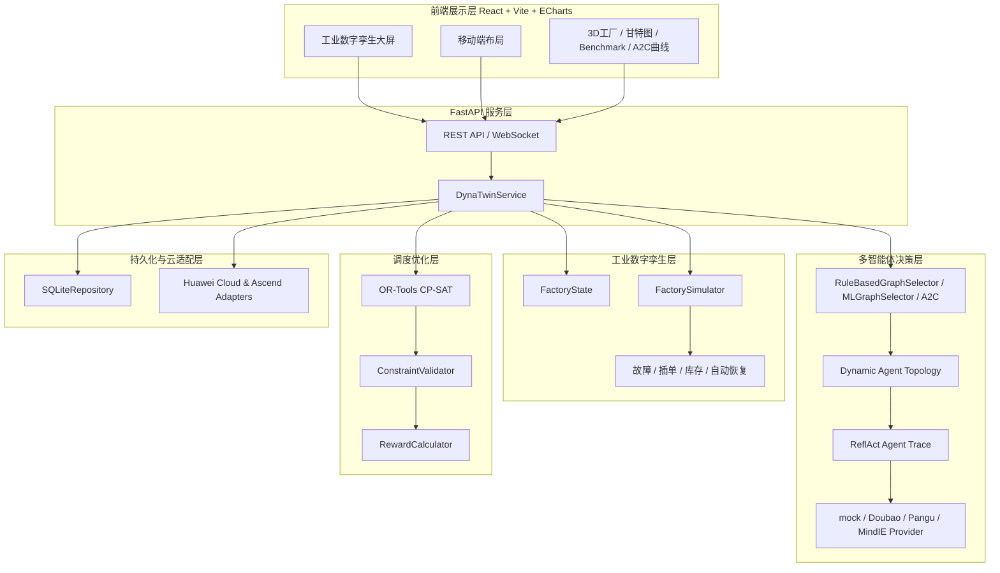

# DynaTwin-Swarm

<p align="center">
  
  
  
  
  
  
  
</p>

<h3 align="center">工业数字孪生智能排产系统</h3>

<p align="center">
  面向贵州磷化工、非煤矿山、智能制造产线与工业园区数字孪生场景，融合 Dynamic Agent Topology、ReflAct、LLM Provider 与 OR-Tools CP-SAT 的多智能体协同调度系统。
</p>

> 本项目基于 GPTSwarm 框架扩展开发，复用了其 Graph、Node、CompositeGraph、Swarm、LLM Provider、Memory 与 Edge Optimizer 等抽象，并在其上新增工业数字孪生、调度求解、云适配与可视化看板能力。

---

## 项目简介

DynaTwin-Swarm 是一个可本地运行的工业 AI 调度原型系统。系统将工厂中的机器、订单、工序、库存、工人、告警和恢复计划统一建模为 `FactoryState`，当设备故障、紧急插单、库存变化或机器恢复等事件发生时，后端会更新数字孪生状态，动态选择合适的 Agent 协作拓扑，执行 ReflAct 风格的可审计推理，并调用 OR-Tools CP-SAT 求解器生成可执行排程。

系统默认使用本地 mock 与 SQLite 跑通完整 Demo；当配置真实环境变量后，可逐步接入 Doubao、PanguLM、MindIE、GaussDB、OBS、IoTDA、EventGrid、FunctionGraph 与 ModelArts。

---

## 效果截图

> 以下截图来自 `docs/screenshots/`，用于展示当前系统的大屏界面、故障重排、Benchmark 与 A2C 训练效果。

| 正常排产总览 | 故障自动重排 |
| --- | --- |
|  |  |

| Benchmark 结果 | A2C 训练过程 |
| --- | --- |
|  |  |

---

## 核心特性

- **工业数字孪生状态建模**：使用 Pydantic 定义 `Machine`、`Order`、`Operation`、`Material`、`Worker`、`MachineAlert`、`FactoryState`、`SchedulePlan`、`ExecutionRecord` 等核心实体。
- **工业事件模拟器**：支持正常推进、随机设备故障、机器自动恢复、紧急订单插入、库存消耗、M3过热、物料短缺、工人技能不匹配等事件。
- **ReflAct 工业 Agent**：每个 Agent 输出 `current_state / goal / gap / constraints / risk_level / recommended_action / evidence / confidence`，保留可审计决策字段，不暴露隐藏推理链。
- **动态 Agent 拓扑选择**：内置 `serial_chain`、`parallel_fusion`、`supervisor_tree`、`high_risk_review` 等拓扑模板，根据任务风险、资源冲突和告警情况动态选择协作结构。
- **LLM 推理与 CP-SAT 解耦**：LLM Agent 负责风险解释与调度建议，CP-SAT 负责严格满足机器能力、故障隔离、工序先后、库存、工人技能、交期与安全约束。
- **公共 Job Shop Benchmark**：接入 FT06、LA40、ABZ9、SWV20、DMU80 等公开 Job Shop Scheduling 数据集，支持从 API 直接运行 Benchmark。
- **A2C Top-K 图结构优化**：实现 `A2CEdgeOptimizer`、`CriticNetwork`、`CandidateGraphStore` 与 `A2CExperimentRunner`，用于探索更优 Agent 拓扑选择策略。
- **可训练 Graph Selector**：提供 selector 数据集生成、RandomForest 训练、评估和 ModelArts LoRA 训练适配接口。
- **FastAPI 后端与 WebSocket**：提供状态、排程、拓扑、Agent Trace、OEE、事件历史、Benchmark、A2C 实验等 API。
- **React/Vite 工业大屏**：使用 ECharts、ECharts-GL、DataV、React 19 构建 3D 工厂布局、AI 推理日志、订单队列、甘特图、Benchmark 与移动端布局。
- **SQLite 本地持久化**：保存状态、排程、执行记录、拓扑选择、事件历史与实验结果。
- **华为云与昇腾适配**：PanguLM、MindIE、GaussDB、OBS、IoTDA、EventGrid、FunctionGraph、ModelArts 均有 Adapter 或 mock fallback，不配置真实凭证时不会伪造连接。

---

## 系统架构



---

## 技术栈

| 层级 | 技术 |
| --- | --- |
| 后端 API | Python 3.10+、FastAPI、Pydantic、WebSocket、python-dotenv |
| 调度求解 | OR-Tools CP-SAT、Greedy fallback、ConstraintValidator、RewardCalculator |
| 多智能体 | Graph/Node/Swarm 执行抽象、Industrial Agent、ReflAct schema、Dynamic Topology |
| 图选择与优化 | RuleBasedGraphSelector、MLGraphSelector、RandomForestClassifier、A2CEdgeOptimizer、CandidateGraphStore |
| 大模型 Provider | mock、Doubao Ark API、PanguLM、MindIE、OpenAI optional |
| 数据集 | JSPLib / OR-Library 风格 Job Shop Scheduling Benchmark JSON |
| 持久化 | SQLiteRepository、GaussDBRepository fallback |
| 前端 | React 19、Vite 7、TypeScript、ECharts、ECharts-GL、DataV、Recharts、ReactFlow、Tailwind CSS |
| 云与昇腾 | Huawei Cloud Adapter、PanguLM、MindIE、GaussDB、OBS、IoTDA、EventGrid、FunctionGraph、ModelArts |
| 工程化 | pytest、Docker Compose、PowerShell/PyCharm 本地运行 |

---

## 快速启动

### 1. 克隆项目

```powershell
git clone https://github.com/wjhard/DynaTwin-Swarm.git
cd DynaTwin-Swarm
```

如果你是在当前本地目录运行：

```powershell
cd DynaTwin-Swarm
```

### 2. 安装 Python 依赖

推荐 Python 3.10+。本项目在 Windows + Anaconda 环境下开发，可直接使用：

```powershell
C:\Anaconda\python.exe -m pip install -e .
C:\Anaconda\python.exe -m pip install fastapi uvicorn python-dotenv httpx ortools scikit-learn joblib pytest
```

如果你使用 Poetry：

```powershell
pip install poetry
poetry install
```

### 3. 配置环境变量

复制示例配置：

```powershell
copy .env.example .env
```

默认本地 mock 模式即可运行：

```env
APP_ENV=local
LLM_PROVIDER=mock
DATABASE_PROVIDER=sqlite
SQLITE_PATH=./data/dynatwin.db
```

如需接入豆包：

```env
LLM_PROVIDER=doubao
DOUBAO_API_KEY=你的API Key
DOUBAO_MODEL=doubao-pro-32k-240615
```

> 注意：不要提交 `.env` 或任何真实密钥。

### 4. 启动后端

```powershell
C:\Anaconda\python.exe -m uvicorn backend.main:app --host 127.0.0.1 --port 8010 --reload
```

健康检查：

```text
http://127.0.0.1:8010/health
```

### 5. 启动前端

```powershell
cd frontend
npm install
npm run dev -- --host 0.0.0.0 --port 5174
```

浏览器打开：

```text
http://127.0.0.1:5174
```

手机访问时，请确保手机和电脑在同一 WiFi，并使用电脑局域网 IP：

```text
http://<电脑局域网IP>:5174
```

后端也需要监听局域网：

```powershell
C:\Anaconda\python.exe -m uvicorn backend.main:app --host 0.0.0.0 --port 8010 --reload
```

---

## 常用命令

### 本地 Demo

```powershell
C:\Anaconda\python.exe scripts/run_local_demo.py
```

### 运行数字孪生模拟器

```powershell
C:\Anaconda\python.exe scripts/simulate_factory.py --scenario normal
C:\Anaconda\python.exe scripts/simulate_factory.py --scenario main
```

### Graph Selector 训练

```powershell
C:\Anaconda\python.exe scripts/generate_selector_dataset.py
C:\Anaconda\python.exe scripts/train_graph_selector.py
C:\Anaconda\python.exe scripts/evaluate_selector.py
```

### A2C 实验

```powershell
C:\Anaconda\python.exe scripts/run_a2c_experiment.py
C:\Anaconda\python.exe scripts/export_topk_graphs.py
```

### 测试

```powershell
C:\Anaconda\python.exe -m pytest -q
```

### 前端构建

```powershell
cd frontend
npm install
npm run build
```

### Docker 本地部署

```powershell
docker compose up --build
```

---

## API 概览

| 方法 | 路径 | 说明 |
| --- | --- | --- |
| `GET` | `/health` | 后端健康检查 |
| `GET` | `/api/state` | 获取最新工厂数字孪生状态 |
| `POST` | `/api/tasks/run` | 运行指定调度场景 |
| `POST` | `/api/events/machine-alert` | 触发设备告警事件 |
| `POST` | `/api/events/order-created` | 插入紧急订单 |
| `POST` | `/api/simulation/tick` | 推进工厂时钟并按需重排 |
| `POST` | `/api/simulation/scenario` | 触发随机故障、随机订单或复合异常 |
| `GET` | `/api/schedules/latest` | 获取最新排程 |
| `GET` | `/api/traces/latest` | 获取最新 Agent 推理轨迹 |
| `GET` | `/api/topology/latest` | 获取最新拓扑选择 |
| `GET` | `/api/factory/oee` | 获取 OEE 指标 |
| `GET` | `/api/datasets/public` | 获取公共 Benchmark 数据集列表 |
| `POST` | `/api/datasets/public/{dataset_id}/run` | 运行指定公共数据集 |
| `POST` | `/api/experiments/run_a2c` | 运行 A2C 拓扑优化实验 |
| `GET` | `/api/integrations/status` | 获取华为云、豆包、MindIE 等适配状态 |

---

## Benchmark 实验结果

以下为项目文档和系统演示中使用的真实实验数值。

| 数据集 | 规模 | 本系统 Makespan | 已知最优值 | 与最优差距 | 说明 |
| --- | ---: | ---: | ---: | ---: | --- |
| JSPLib FT06 | 6 jobs × 6 machines | **55** | 55 | **0.0%** | 达到全局最优解 |
| Lawrence LA40 | 15 jobs × 15 machines | **1234** | 1222 | **1.0%** | 接近最优，达到工业级应用标准 |
| Adams-Balas ABZ9 | 20 jobs × 15 machines | **707** | 678 | **4.3%** | 大规模实例上显著优于早期版本 |
| Storer-Wu SWV20 | 50 jobs × 10 machines | 测试中 | 1675 | 待测 | 用于大规模压力测试 |
| Demirkol DMU80 | 50 jobs × 20 machines | 测试中 | 暂无 | - | 用于超大规模演示 |

---

## 核心创新点

### 1. 动态 Agent 拓扑自适应选择

传统多智能体系统常使用固定链路。DynaTwin-Swarm 会根据 `TaskProfile` 中的风险等级、故障数量、紧急订单、库存短缺、资源冲突等特征选择不同拓扑：

- `serial_chain`：低风险常规排程，轻量快速。
- `parallel_fusion`：资源冲突或大型 Benchmark，多个专业 Agent 并行分析后汇聚。
- `supervisor_tree`：复杂复合任务，由 Supervisor 协调分支 Agent。
- `high_risk_review`：设备故障或高风险告警，启用 Risk、Critic、FinalDecision 多层审核。

### 2. ReflAct 工业可审计推理

每个工业 Agent 都输出统一的 `ReflActDecision`：

```text
当前状态 current_state
生产目标 goal
状态偏差 gap
硬性约束 constraints
风险等级 risk_level
建议动作 recommended_action
证据 evidence
置信度 confidence
```

这样既能利用 LLM 的解释能力，又能避免把不可审计的隐藏推理链暴露给生产系统。

### 3. LLM 与 CP-SAT 解耦

LLM 不直接生成最终机器时间表，而是负责分析状态、解释风险、提出建议动作；CP-SAT 求解器接收结构化约束，输出每道工序的 `start_minute / end_minute / machine_id`。系统同时保留可解释性与可执行性。

### 4. 工业事件闭环

系统支持：

- 随机设备故障：故障机器自动隔离，未完成工序标记为 `needs_reassignment`。
- 自动恢复：`recovery_schedule` 到时后机器恢复可用并重新纳入调度资源池。
- 紧急订单：动态创建订单并触发重排。
- 自动 tick：每 15 分钟推进一次工厂时钟，并按事件变化自动触发重排。

### 5. 本地 mock 到华为昇腾的可迁移架构

所有云服务均通过 Adapter 访问。没有真实账号或昇腾硬件时，系统使用 mock/local fallback；有凭证后可逐步切换到真实服务。

---

## 项目结构

```text
.
├── backend/
│   ├── main.py                  # FastAPI 应用入口与 API 路由
│   └── service.py               # DynaTwinService 业务编排
├── frontend/
│   ├── src/main.tsx             # React 工业大屏与移动端布局
│   ├── src/styles.css           # 大屏、移动端、Modal、通知样式
│   └── vite.config.ts           # Vite 开发服务与代理
├── swarm/
│   ├── domain/manufacturing/    # 工业数字孪生模型、模拟器、调度求解器
│   ├── environment/agents/industrial/
│   │   └── agents.py            # 任务路由、监控、诊断、订单、资源、调度、风险等 Agent
│   ├── selector/                # 拓扑模板、规则选择器、ML选择器、执行器
│   ├── optimizer/edge_optimizer/# A2C、Top-K 候选图、边优化器
│   ├── llm/industrial_provider.py
│   ├── integrations/huawei/     # Pangu、MindIE、OBS、IoTDA、EventGrid、ModelArts 等适配
│   └── persistence/             # SQLite / GaussDB fallback Repository
├── datasets/public_jobshop/     # FT06、LA40、ABZ9、SWV20、DMU80
├── scripts/                     # Demo、训练、评估、截图和文档生成脚本
├── docs/                        # 架构、API、部署、华为、实验、豆包集成文档
├── reports/experiments/         # 实验输出
├── presentation/                # 参赛路演PPT与项目文档PPT
├── test/                        # 后端、调度器、Agent、Selector、Adapter 测试
├── docker-compose.yml
├── pyproject.toml
└── README.md
```

---

## 团队信息

- **作者**：王骏
- **单位**：贵州大学网络与信息安全专业
- **指导教师**：谭伟杰教授
- **实验室**：贵州省公共大数据重点实验室
- **研究方向**：IoT 安全、多智能体系统、工业 AI、工业数字孪生调度
- **GitHub**：<https://github.com/wjhard/DynaTwin-Swarm>

---

## 说明

本项目当前重点是参赛演示、工程验证与可运行原型，不会在未配置真实凭证时宣称已连接真实华为云、盘古大模型、MindIE 或 GaussDB。默认 mock/local 模式已经可以完整演示工业事件、Agent 推理、拓扑选择、CP-SAT 排程、SQLite 持久化与前端大屏。
