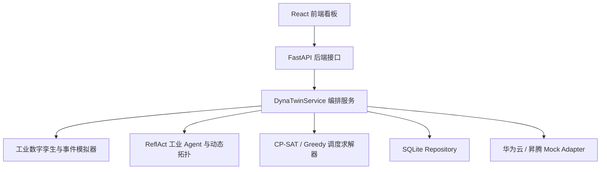

# DynaTwin-Swarm 项目完整说明文档

## 1. 项目一句话介绍

DynaTwin-Swarm 是在 GPTSwarm 基础上扩展出来的工业数字孪生调度系统。它把工厂里的设备、订单、库存、告警和工人技能抽象成一个本地数字孪生状态，然后根据当前生产风险动态组织多个工业 Agent 协作，最后调用调度求解器生成生产排程方案。

可以把它理解成一个面向工业场景的智能排产演示系统：

```text
工厂状态 -> 风险识别 -> 动态选择 Agent 拓扑 -> 多 Agent 决策 -> 约束调度求解 -> 前端看板展示
```

当前系统可以在本地完整运行。华为云、盘古大模型、MindIE、GaussDB 等能力已经预留适配层，但在没有真实账号和硬件环境时默认使用 mock 或本地 fallback，不会伪装成真实云连接。

## 2. 项目目标

本项目的目标不是单纯做一个静态网页，而是实现一个可运行的工业 AI 调度原型，重点包括：

- 用数字孪生模型表示工厂当前状态。
- 用事件模拟器构造设备异常、紧急订单、库存不足等工业事件。
- 用 ReflAct 风格 Agent 记录可解释的观察、反思和行动建议。
- 根据任务风险动态选择 Agent 协作拓扑，而不是固定流程。
- 用 CP-SAT 或 fallback 调度器生成实际生产排程。
- 用 React 前端展示设备、订单、库存、风险、拓扑、Agent 决策和甘特图。
- 用 SQLite 保存状态、排程、拓扑、执行记录和事件。
- 预留华为云和昇腾生态接入边界。

## 3. 当前系统运行形态

当前项目由两个服务组成：

| 服务 | 地址 | 作用 |
| --- | --- | --- |
| 后端 FastAPI | `http://127.0.0.1:8010` | 提供工厂状态、任务执行、事件触发、排程结果等 API |
| 前端 Vite React | `http://127.0.0.1:5174` | 展示和操作 DynaTwin-Swarm 看板 |

注意：`http://127.0.0.1:8010` 是后端 API 根地址，不是页面地址。直接打开根路径可能显示：

```json
{"detail":"Not Found"}
```

这是正常的。后端健康检查应该打开：

```text
http://127.0.0.1:8010/health
```

真正的软件界面应该打开：

```text
http://127.0.0.1:5174/
```

## 4. 总体架构

系统可以分成五层：



一次完整运行过程如下：

1. 用户在前端点击按钮，例如 `Run Normal Scheduling` 或 `Trigger M3 Overheat`。
2. 前端向后端 API 发送请求。
3. 后端根据场景创建或更新工厂数字孪生状态。
4. 系统从当前状态中提取任务特征，例如风险等级、资源冲突数量、告警数量。
5. Graph Selector 选择合适的 Agent 拓扑。
6. IndustrialTopologyExecutor 按拓扑执行多个工业 Agent。
7. 调度求解器生成生产排程。
8. 约束验证器检查安全、库存、交期、技能、设备状态等约束。
9. 后端把状态、拓扑、决策、排程和事件保存到 SQLite。
10. 前端刷新数据并展示结果。

## 5. 项目目录结构

核心目录如下：

```text
backend/
  main.py                  FastAPI 应用入口，定义 API 路由和 CORS
  service.py               DynaTwinService，负责业务编排

frontend/
  src/main.tsx             React 单页看板主逻辑
  src/styles.css           前端样式
  vite.config.ts           Vite 开发服务配置
  package.json             前端依赖和脚本

swarm/domain/manufacturing/
  models.py                工业数字孪生 Pydantic 数据模型
  simulator.py             工业事件模拟器和场景生成器
  scheduler.py             CP-SAT / Greedy 调度求解和约束验证
  store.py                 工厂状态存储接口和实现

swarm/environment/agents/industrial/
  agents.py                各类工业 Agent
  reflact.py               ReflAct 执行步骤

swarm/selector/
  topology.py              Agent 拓扑模板定义
  graph_selector.py        规则 Graph Selector
  ml_selector.py           可训练 Graph Selector
  execution.py             按拓扑执行 Agent
  dataset.py               训练数据生成

swarm/persistence/
  repository.py            SQLite Repository 和接口定义

swarm/integrations/huawei/
  config.py                华为云配置读取
  clients.py               华为云服务 mock client
  providers.py             盘古 / MindIE provider
  repositories.py          GaussDB fallback repository

swarm/optimizer/edge_optimizer/
  a2c.py                   A2C 图结构优化
  candidate_graph_store.py Top-K 候选图保存

scripts/
  simulate_factory.py              数字孪生模拟脚本
  run_local_demo.py                本地 Demo 脚本
  generate_selector_dataset.py     生成 Graph Selector 数据集
  train_graph_selector.py          训练 Graph Selector
  evaluate_selector.py             评估 Graph Selector
  run_a2c_experiment.py            运行 A2C 实验
  export_topk_graphs.py            导出 Top-K 图结构

docs/
  API.md
  ARCHITECTURE.md
  DEPLOYMENT.md
  DEPLOYMENT_ASCEND.md
  EXPERIMENTS.md
  HUAWEI_INTEGRATION.md
  PROJECT_OVERVIEW_CN.md
```

## 6. 后端说明

### 6.1 后端技术栈

后端主要使用：

| 技术 | 作用 |
| --- | --- |
| Python | 后端主语言 |
| FastAPI | HTTP API 和 WebSocket 服务 |
| Pydantic | 数据模型校验和序列化 |
| SQLite | 本地持久化数据库 |
| OR-Tools CP-SAT | 生产调度求解 |
| scikit-learn | Graph Selector 训练 |
| pandas / numpy | 数据处理和实验分析 |
| PyTorch | A2C 图优化实验 |

### 6.2 后端入口

后端入口文件是：

```text
backend/main.py
```

运行命令：

```powershell
C:\Anaconda\python.exe -m uvicorn backend.main:app --host 127.0.0.1 --port 8010 --reload
```

在 PyCharm 里等价于：

```text
Module name: uvicorn
Parameters: backend.main:app --host 127.0.0.1 --port 8010 --reload
Working directory: 项目根目录
```

### 6.3 后端核心服务

核心业务编排类是：

```text
backend/service.py
```

其中 `DynaTwinService` 负责：

- 创建或加载工厂状态。
- 运行不同工业场景。
- 调用 RuleBasedGraphSelector 选择拓扑。
- 执行 IndustrialTopologyExecutor。
- 调用 IndustrialScheduleSolver 生成排程。
- 生成风险摘要。
- 保存执行记录、拓扑、排程和事件。

### 6.4 后端 API

主要 API 如下：

| 方法 | 路径 | 功能 |
| --- | --- | --- |
| GET | `/health` | 健康检查 |
| POST | `/api/tasks/run` | 运行一个调度场景 |
| POST | `/api/events/machine-alert` | 触发设备告警 |
| POST | `/api/events/order-created` | 创建紧急订单 |
| POST | `/api/demo/reset` | 重置 Demo 状态 |
| GET | `/api/state` | 获取最新工厂状态 |
| GET | `/api/schedules/latest` | 获取最新调度方案 |
| GET | `/api/traces/latest` | 获取最新 Agent 决策记录 |
| GET | `/api/topology/latest` | 获取最新拓扑选择 |
| GET | `/api/events/latest` | 获取最新事件流 |
| GET | `/api/experiments/latest` | 获取最新实验摘要 |
| WS | `/ws/dashboard` | 推送一次 dashboard 快照 |

### 6.5 `/api/tasks/run`

前端点击排产按钮时主要调用这个接口。

请求示例：

```json
{
  "scenario": "main"
}
```

支持的典型场景包括：

| 场景 | 含义 |
| --- | --- |
| `normal` | 正常排产 |
| `main` | 组合异常 Demo |
| `single_machine_failure` | 单设备故障 |
| `multi_resource_conflict` | 多资源冲突 |
| `inventory_shortage` | 库存不足 |
| `worker_skill_mismatch` | 工人技能不匹配 |

响应中包含：

- `task_id`：任务编号。
- `task_profile`：任务特征。
- `selected_topology`：选中的 Agent 拓扑。
- `topology_selection`：拓扑选择原因和置信度。
- `agent_traces`：Agent 决策链。
- `best_plan`：最佳排程方案。
- `alternative_plans`：备选方案。
- `risk_summary`：风险摘要。
- `metrics`：调度指标。

### 6.6 后端持久化

默认数据库是：

```text
data/dynatwin.db
```

使用 SQLiteRepository 保存：

- 工厂状态 `states`
- 调度方案 `schedules`
- 执行记录 `executions`
- 拓扑选择 `topologies`
- 事件流 `events`
- 实验结果 `experiments`

这意味着刷新页面或多次运行后，系统仍然能读取最近一次状态。

## 7. 前端说明

### 7.1 前端技术栈

前端主要使用：

| 技术 | 作用 |
| --- | --- |
| React 19 | 页面和组件渲染 |
| TypeScript | 类型检查 |
| Vite | 前端开发服务器和构建 |
| React Flow | Agent 拓扑图可视化 |
| Recharts | 调度指标柱状图 |
| lucide-react | 页面图标 |
| CSS | 页面布局和样式 |

### 7.2 前端入口

前端入口文件是：

```text
frontend/src/main.tsx
```

样式文件是：

```text
frontend/src/styles.css
```

Vite 配置是：

```text
frontend/vite.config.ts
```

### 7.3 前端运行命令

进入前端目录：

```powershell
cd frontend
```

启动前端：

```powershell
npm run dev -- --host 127.0.0.1 --port 5174
```

前端页面：

```text
http://127.0.0.1:5174/
```

前端默认连接后端：

```text
http://127.0.0.1:8010
```

也可以通过环境变量覆盖：

```text
VITE_API_BASE=http://127.0.0.1:8010
```

### 7.4 前端页面结构

当前页面是一个单页 Dashboard，主要区域如下：

| 区域 | 功能 |
| --- | --- |
| 顶部状态栏 | 显示 API、PanguLM、MindIE、GaussDB、OBS 等连接模式 |
| 工具栏按钮 | 触发不同场景和事件 |
| 运行状态条 | 显示 Ready/Running、场景、机器数、订单数、工序数、告警数 |
| Machines | 展示设备状态 |
| Orders | 展示订单队列 |
| Inventory | 展示库存 |
| Risk | 展示风险等级和拓扑选择原因 |
| Dynamic Agent Topology | 展示当前 Agent 协作图 |
| ReflAct Decisions | 展示各 Agent 的决策 |
| Gantt Schedule | 展示调度甘特图 |
| Metrics | 展示调度指标柱状图 |
| Alternative Plans | 展示备选方案 |
| Event Stream | 展示事件流 |
| History | 展示运行历史 |

### 7.5 前端按钮功能

页面上有五个主要按钮：

| 按钮 | 调用接口 | 作用 |
| --- | --- | --- |
| Run Normal Scheduling | `POST /api/tasks/run` | 运行正常排产 |
| Trigger M3 Overheat | `POST /api/events/machine-alert` + `POST /api/tasks/run` | 模拟 M3 过热并重新排产 |
| Create Urgent Order O4 | `POST /api/events/order-created` + `POST /api/tasks/run` | 创建紧急订单并重新排产 |
| Run Composite Incident Demo | `POST /api/tasks/run` | 运行组合异常 Demo |
| Reset Demo | `POST /api/demo/reset` + `POST /api/tasks/run` | 重置并运行正常排产 |

## 8. 工业数字孪生功能

数字孪生层定义了工厂里可以被系统理解和调度的实体。

### 8.1 机器

机器模型包含：

- 机器 ID
- 名称
- 类型
- 能力，例如 cutting、precision
- 状态，例如 available、busy、failed
- 当前订单
- 温度
- 安全等级

页面中的 `Machines` 面板展示这些信息。

### 8.2 订单

订单模型包含：

- 订单 ID
- 优先级，例如 normal、high、urgent
- 截止时间
- 工序列表
- 数量
- 状态

每个订单可以包含多个工序，例如：

```text
O1-CUT
O1-MILL
```

### 8.3 工序

工序模型包含：

- 工序 ID
- 所属订单
- 工序名称
- 所需机器能力
- 加工时长
- 前置工序
- 物料需求
- 工人技能需求
- 安全等级
- 切换成本

调度求解器会根据这些字段安排机器和时间。

### 8.4 库存

库存模型包含：

- 物料 ID
- 物料名称
- 总数量
- 已预留数量
- 单位

当前示例中有：

- Steel Blank
- Coolant
- Precision Fixture

### 8.5 告警

告警模型表示设备异常，例如：

- M3 温度过高
- 告警等级 critical
- 是否要求停机

点击 `Trigger M3 Overheat` 会触发类似告警。

## 9. 事件模拟器

事件模拟器位于：

```text
swarm/domain/manufacturing/simulator.py
```

它提供多个场景：

| 场景 | 说明 |
| --- | --- |
| base_state | 初始工厂状态 |
| normal | 正常生产状态 |
| main | 综合异常状态 |
| single_machine_failure | M3 设备过热或失败 |
| multi_resource_conflict | 紧急订单和资源冲突 |
| inventory_shortage | 物料不足 |
| worker_skill_mismatch | 工人技能不匹配 |

这些场景不是前端写死的，而是由后端模拟器生成状态，再经过 Agent 和调度器计算。

## 10. ReflAct 工业 Agent

### 10.1 ReflAct 是什么

在这个项目里，ReflAct 可以理解为：

```text
观察当前状态 -> 识别目标差距 -> 考虑约束 -> 给出行动建议 -> 记录证据
```

每个 Agent 的输出不是一句普通文本，而是结构化决策：

- `current_state`：当前状态观察
- `goal`：目标
- `gap`：当前状态与目标之间的差距
- `constraints`：需要考虑的约束
- `risk_level`：风险等级
- `recommended_action`：推荐动作
- `evidence`：证据
- `confidence`：置信度

### 10.2 当前 Agent 列表

| Agent | 作用 |
| --- | --- |
| TaskRouterAgent | 判断任务应该进入哪类拓扑 |
| MonitorAgent | 监控设备、订单、库存和告警 |
| DiagnosisAgent | 分析设备异常原因 |
| OrderAgent | 分析订单优先级和紧急程度 |
| ResourceAgent | 分析库存、设备、工人资源 |
| ScheduleAgent | 建议调用调度求解器 |
| ConstraintAgent | 检查约束和违规风险 |
| RiskAgent | 汇总风险等级 |
| CriticAgent | 对方案进行批判性复核 |
| FinalDecisionAgent | 输出最终决策 |
| ReportAgent | 汇总报告 |

前端右侧的 `ReflAct Decisions` 就是这些 Agent 的输出。

## 11. 动态 Agent 拓扑

动态拓扑是本项目区别于普通固定流程系统的关键点。

系统不会永远使用同一条 Agent 链路，而是根据任务风险选择不同图结构。

### 11.1 当前支持的拓扑

| 拓扑 | 适用场景 |
| --- | --- |
| `serial_chain` | 低风险、正常排产 |
| `parallel_fusion` | 多资源并行分析 |
| `supervisor_tree` | 需要监督或汇总 |
| `high_risk_review` | 高风险异常，需要风险和批判复核 |

### 11.2 低风险拓扑示例

```text
TaskRouter -> Monitor -> Schedule -> Constraint -> Report
```

正常排产通常选择这个拓扑。

### 11.3 高风险拓扑示例

```text
TaskRouter
  -> Monitor
  -> Diagnosis
  -> Order
  -> Resource
  -> Schedule
  -> Constraint
  -> Risk
  -> Critic
  -> FinalDecision
  -> Report
```

当出现设备故障、紧急订单、库存不足等情况时，会选择更复杂的高风险复核拓扑。

## 12. Graph Selector

Graph Selector 的作用是：

```text
根据任务特征选择合适的 Agent 拓扑
```

当前有两种实现：

| 实现 | 文件 | 说明 |
| --- | --- | --- |
| RuleBasedGraphSelector | `swarm/selector/graph_selector.py` | 基于规则选择拓扑 |
| MLGraphSelector | `swarm/selector/ml_selector.py` | 使用 RandomForest 训练选择器 |

规则选择器会参考：

- 风险等级
- 是否存在设备告警
- 是否存在资源冲突
- 是否需要并行分析
- 是否需要 Critic 复核

MLGraphSelector 则可以通过脚本训练：

```powershell
C:\Anaconda\python.exe scripts/generate_selector_dataset.py
C:\Anaconda\python.exe scripts/train_graph_selector.py
C:\Anaconda\python.exe scripts/evaluate_selector.py
```

## 13. 调度求解器

调度求解器位于：

```text
swarm/domain/manufacturing/scheduler.py
```

它的作用是：

```text
把订单工序安排到合适机器和时间段上
```

### 13.1 约束

当前考虑的约束包括：

- 失败机器不能分配任务。
- 机器必须具备工序所需能力。
- 工序必须满足前置依赖。
- 库存必须足够。
- 工人技能必须匹配。
- 尽量满足订单交期。
- 安全等级不能违反。
- 同一台机器同一时间不能执行多个工序。

### 13.2 求解方式

优先使用：

```text
OR-Tools CP-SAT
```

如果 OR-Tools 不可用或求解失败，会 fallback 到：

```text
确定性 Greedy 调度
```

这样保证本地 Demo 不会因为某个外部依赖失败而完全不可运行。

### 13.3 输出

调度器输出：

- `best_plan`：最佳计划
- `alternative_plans`：备选计划
- `violations`：约束违规
- `metrics`：调度指标

前端 `Gantt Schedule` 使用 `best_plan.items` 绘制甘特图。

## 14. 华为云与昇腾适配

华为云相关代码位于：

```text
swarm/integrations/huawei/
```

当前适配对象包括：

| 服务 | 当前状态 |
| --- | --- |
| PanguLM | mock provider |
| MindIE | mock provider |
| GaussDB | SQLite fallback |
| OBS | local fallback |
| IoTDA | local event bus |
| EventGrid | local router |
| FunctionGraph | local trigger |
| ModelArts | local training mock |

顶部状态栏显示这些能力的当前模式。当前没有真实华为云账号、API Key 或昇腾环境，因此系统明确显示 mock 或 fallback。

## 15. 训练和实验能力

项目包含可训练 Graph Selector 和 A2C 图结构优化脚本。

### 15.1 Graph Selector 训练

相关脚本：

```text
scripts/generate_selector_dataset.py
scripts/train_graph_selector.py
scripts/evaluate_selector.py
```

用途：

- 生成不同工业场景下的任务特征数据。
- 训练拓扑选择模型。
- 评估模型选择准确率。

### 15.2 A2C 图结构优化

相关脚本：

```text
scripts/run_a2c_experiment.py
scripts/export_topk_graphs.py
```

用途：

- 用 Actor-Critic 思路优化 Agent 图结构。
- 保存 Top-K 候选图。
- 为后续更智能的拓扑选择做准备。

## 16. 本地运行方法

### 16.1 启动后端

在项目根目录运行：

```powershell
C:\Anaconda\python.exe -m uvicorn backend.main:app --host 127.0.0.1 --port 8010 --reload
```

验证：

```text
http://127.0.0.1:8010/health
```

成功时返回：

```json
{"status":"ok","mode":"local"}
```

### 16.2 启动前端

打开另一个命令行窗口：

```powershell
cd frontend
npm run dev -- --host 127.0.0.1 --port 5174
```

访问：

```text
http://127.0.0.1:5174/
```

### 16.3 PyCharm 后端运行配置

在 PyCharm 中新建 Python 运行配置：

```text
Name:
DynaTwin Backend

Module name:
uvicorn

Parameters:
backend.main:app --host 127.0.0.1 --port 8010 --reload

Working directory:
项目根目录

Environment variables:
PYTHONUNBUFFERED=1;APP_ENV=local;LLM_PROVIDER=mock;SQLITE_PATH=./data/dynatwin.db
```

注意：如果 `8010` 已被占用，说明后端可能已经在运行。需要先停掉旧进程，或者换一个端口。

### 16.4 PyCharm 前端运行配置

新建 npm 运行配置：

```text
package.json:
frontend/package.json

Command:
run

Scripts:
dev

Arguments:
-- --host 127.0.0.1 --port 5174

Working directory:
frontend

Environment variables:
VITE_API_BASE=http://127.0.0.1:8010
```

## 17. 测试和构建

### 17.1 后端测试

项目根目录运行：

```powershell
C:\Anaconda\python.exe -m pytest -q
```

当前验证通过结果为：

```text
65 passed
```

测试中的 pandas、Starlette warning 是依赖版本提示，不是当前系统功能错误。

### 17.2 前端构建

进入前端目录：

```powershell
cd frontend
npm run build
```

构建成功后会生成：

```text
frontend/dist/
```

Vite 可能提示 chunk size 大于 500 kB，这是构建体积提示，不影响当前运行。

## 18. 当前前端展示内容解释

### 18.1 Machines

展示机器状态，例如：

```text
M1 Cutter 1 busy - 25C job O1
M2 Cutter 2 available - 25C cutting
```

含义：

- M1 正在处理 O1。
- M2 空闲，可以执行 cutting。

### 18.2 Orders

展示订单队列，例如：

```text
O1 normal 18:00 2 ops
O2 high 16:00 2 ops
```

含义：

- O1 普通订单，18:00 前完成，有 2 道工序。
- O2 高优先级订单，16:00 前完成，有 2 道工序。

### 18.3 Inventory

展示库存，例如：

```text
Steel Blank 12/12 pcs
Coolant 4/4 pcs
```

含义：

- 当前可用量 / 总量。

### 18.4 Risk

展示系统风险等级和拓扑选择原因。

例如：

```text
LOW
normal task uses serial chain
```

说明当前风险较低，因此使用简单串行拓扑。

### 18.5 Dynamic Agent Topology

展示本次任务使用的 Agent 协作图。

低风险时通常是：

```text
TaskRouter -> Monitor -> Schedule -> Constraint -> Report
```

高风险时会出现更多节点，例如：

```text
Diagnosis
Resource
Risk
Critic
FinalDecision
```

### 18.6 ReflAct Decisions

展示每个 Agent 的推荐动作，例如：

```text
ScheduleAgent
Invoke CP-SAT solver with safety, inventory, due-date, and skill constraints.
```

这体现系统不是直接给出结果，而是记录了 Agent 的推理链路。

### 18.7 Gantt Schedule

展示最终生产排程，例如：

```text
O2-CUT  M2 08:00-08:47
O1-CUT  M2 08:47-09:49
O2-MILL M4 08:47-11:13
```

含义：

- 哪个工序。
- 分配给哪台机器。
- 开始和结束时间。

### 18.8 Metrics

展示工序耗时柱状图。

### 18.9 Alternative Plans

展示备选方案，例如：

```text
backup plan with 15 minute safety buffer
```

表示系统除了主方案外，还保留一个带安全缓冲的备用方案。

### 18.10 Event Stream

展示事件流，例如：

```json
{"type":"machine_alert","machine_id":"M3"}
{"type":"order_created","order_id":"O4"}
```

### 18.11 History

展示运行历史，例如：

```text
scenario normal -> serial_chain
scenario main -> high_risk_review
```

说明系统运行了什么场景，并选择了哪个拓扑。

## 19. 当前系统已经实现的能力清单

当前已实现：

- 本地 FastAPI 后端。
- React 前端看板。
- 工业数字孪生状态模型。
- 工业事件模拟器。
- 多个工业 ReflAct Agent。
- 动态 Agent 拓扑模板。
- 规则 Graph Selector。
- 可训练 ML Graph Selector。
- A2C 图结构优化脚本。
- OR-Tools CP-SAT 调度求解器。
- Greedy fallback 调度器。
- SQLite 持久化。
- 本地 Demo。
- 事件流。
- WebSocket 快照接口。
- 华为云 mock adapter。
- 盘古大模型 mock provider。
- MindIE mock provider。
- Docker 配置。
- 单元测试和端到端测试。

## 20. 当前系统的真实状态

### 20.1 已真实运行

- FastAPI 后端。
- React 前端。
- 本地数字孪生场景。
- 事件触发。
- Agent 拓扑选择。
- ReflAct 决策链。
- 调度求解。
- SQLite 存储。
- 前端构建。
- pytest 测试。

### 20.2 已实现但未连接真实外部服务

- 华为云配置结构。
- GaussDB repository 边界。
- OBS adapter。
- IoTDA / EventGrid / FunctionGraph adapter。
- ModelArts 训练接口。

### 20.3 当前使用 mock

- PanguLM。
- MindIE。
- 华为云相关服务。

### 20.4 当前主要不足

- 前端还是技术 Demo 风格，不够中文业务系统化。
- 事件影响解释还不够直观。
- 调度前后对比还不够明显。
- Agent 决策目前偏短，需要更像工业专家解释。
- 前端还没有多页面结构。
- 训练和实验结果没有集成到前端页面。
- 真实华为云服务尚未接入。

## 21. 建议优化方向

### 21.1 第一优先级：中文化和业务化

把前端标题和模块改成中文：

| 当前 | 建议 |
| --- | --- |
| Machines | 设备状态 |
| Orders | 订单队列 |
| Inventory | 物料库存 |
| Risk | 风险评估 |
| Dynamic Agent Topology | 动态智能体拓扑 |
| ReflAct Decisions | 智能体决策链 |
| Gantt Schedule | 生产排程甘特图 |
| Event Stream | 事件流 |

### 21.2 第二优先级：增加当前决策摘要

在顶部增加一块：

```text
当前结论：M3 设备过热，系统已冻结高风险设备，并切换任务到 M4。
推荐动作：优先处理 O4 紧急订单，补充 Steel Blank 库存。
采用拓扑：high_risk_review
预计完工：15:23
```

这样用户不用看完所有面板，也能知道系统结论。

### 21.3 第三优先级：异常视觉高亮

点击异常按钮后，应该更明显：

- M3 卡片变红。
- 顶部出现告警横幅。
- 风险等级变红。
- 拓扑图中 Risk / Critic 节点高亮。
- 受影响的甘特图工序标记。

### 21.4 第四优先级：调度前后对比

增加：

```text
异常前方案
异常后方案
变化原因
受影响订单
延误时间
替代设备
```

这样更像真实生产调度系统。

### 21.5 第五优先级：一键演示流程

增加一个按钮：

```text
一键演示
```

自动执行：

1. 正常排产。
2. M3 过热。
3. 紧急订单到达。
4. 库存不足。
5. 动态拓扑切换。
6. 输出最终方案。

这对比赛答辩非常有用。

### 21.6 第六优先级：增加实验评估页面

展示：

- Graph Selector 准确率。
- 不同拓扑 reward 对比。
- A2C Top-K 候选图。
- 调度耗时。
- 约束违规数量。
- Agent 调用次数。

### 21.7 第七优先级：接入真实服务

如果后续有真实环境，可以逐步接入：

- 真实盘古大模型 API。
- MindIE 推理服务。
- GaussDB。
- OBS。
- IoTDA 设备事件。
- ModelArts 训练任务。
- 昇腾 NPU 环境。

## 22. 给答辩或展示时的讲解词

可以这样介绍：

```text
我们这个系统是一个面向工业生产调度的数字孪生多智能体平台。
它首先把设备、订单、物料、告警和人员技能建模成工厂数字孪生状态。
当设备故障、紧急订单或库存不足等事件发生时，系统会自动评估风险，并动态选择不同的 Agent 协作拓扑。
低风险任务使用简单串行链路，高风险任务会增加诊断、资源分析、风险复核、批判评估和最终决策 Agent。
随后系统调用 CP-SAT 调度求解器，在设备能力、库存、交期、安全和人员技能等约束下生成生产排程。
前端看板实时展示设备状态、订单、库存、风险、动态拓扑、Agent 决策链和甘特图。
当前版本在本地 mock 模式下完整运行，同时预留了盘古大模型、MindIE、GaussDB、OBS、IoTDA、ModelArts 和昇腾适配接口。
```

## 23. 总结

DynaTwin-Swarm 当前已经具备一个工业智能调度系统的核心闭环：

```text
状态建模 -> 事件驱动 -> 风险评估 -> 动态拓扑 -> Agent 决策 -> 调度求解 -> 前端展示 -> 数据持久化
```

它现在更接近一个可运行的技术原型。下一步优化重点应该放在：

- 页面中文化。
- 业务解释增强。
- 异常前后对比。
- 一键演示流程。
- 实验结果可视化。
- 真实云服务接入。

如果用于比赛展示，建议优先优化“看得懂”和“讲得清”这两件事，因为底层能力已经具备，展示层的表达会直接影响评委理解。

## 24. 新增优先级：华为技术从 mock 变成真实调用

在当前版本中，华为云相关能力默认是 mock 或 fallback。这保证了没有账号、没有 API Key、没有昇腾环境时系统仍然可以完整运行。但如果用于华为相关比赛或答辩，最关键的加分优化之一是接入真实盘古大模型 API。

推荐优先级：

```text
第二优先级：华为技术从 mock 变成真实调用
```

最容易做且最关键的一步是：

```text
接入真实盘古大模型 API
```

原因：

- 当前 ReflAct Agent 的主体决策仍然以规则和本地 fallback 为主。
- 接入盘古后，每个 Agent 都可以真实调用 LLM 生成观察、风险判断和建议动作。
- 前端状态栏可以从 `PanguLM: mock` 变成 `PanguLM: configured` 或真实调用成功后的 `PanguLM: connected`。
- 这比单纯写“支持华为云”更有说服力。

当前代码已经支持以下状态：

| 状态 | 含义 |
| --- | --- |
| `PanguLM: mock` | 未配置盘古 API，使用本地 fallback |
| `PanguLM: configured` | 已配置 endpoint 和 Key，但还没有成功调用 |
| `PanguLM: connected` | 当前进程中真实 HTTP 调用成功 |
| `PanguLM: error` | 配置了真实调用，但 HTTP 请求失败 |

接入步骤：

1. 注册或登录华为云账号。
2. 进入 ModelArts Studio 或盘古大模型相关控制台。
3. 申请盘古大模型 API 调用权限。
4. 获取真实 endpoint 和 API Key / AppCode / Token。
5. 在本地环境变量中配置：

```text
LLM_PROVIDER=pangu
PANGU_BASE_URL=https://你的盘古API地址
PANGU_API_KEY=你的API密钥
PANGU_AUTH_MODE=bearer
PANGU_MODEL=
PANGU_TEMPERATURE=0.2
PANGU_MAX_TOKENS=600
PANGU_TIMEOUT=20
```

6. 重启后端。
7. 打开：

```text
http://127.0.0.1:8010/api/integrations/status
```

8. 点击前端调度按钮，让 Agent 触发一次真实调用。

代码层面已经涉及：

```text
swarm/integrations/huawei/providers.py
swarm/llm/industrial_provider.py
backend/main.py
frontend/src/main.tsx
docs/PANGU_REAL_API_CN.md
```

注意：不能把真实 API Key 提交到 Git，也不能写进 README 或截图。

这一步完成后，展示时可以强调：

```text
系统默认支持本地 mock 模式，保证无云账号时也能完整演示；
当配置盘古大模型 API 后，工业 ReflAct Agent 会真实调用盘古生成决策说明；
系统不会伪造连接状态，真实调用成功后才显示 connected。
```
